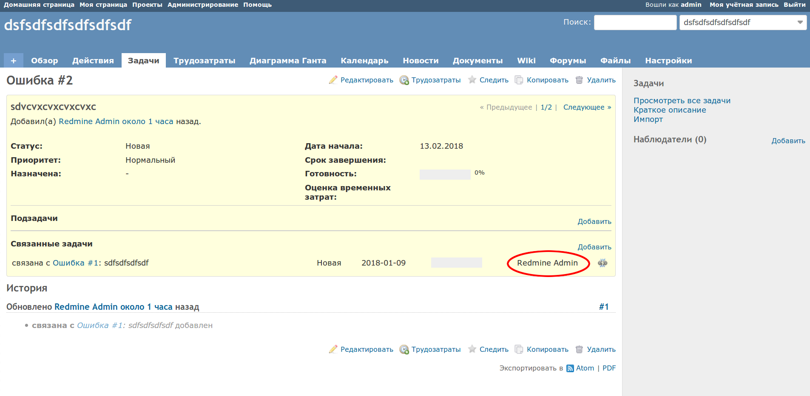

# Redmine Related Issues Assignee Column

This is a plugin for redmine which adds "Assigned to" field to the "Related Issues" table.

Follow standard Redmine plugin installation procedure in order to install the plugin.

Here is an example screenshot:

